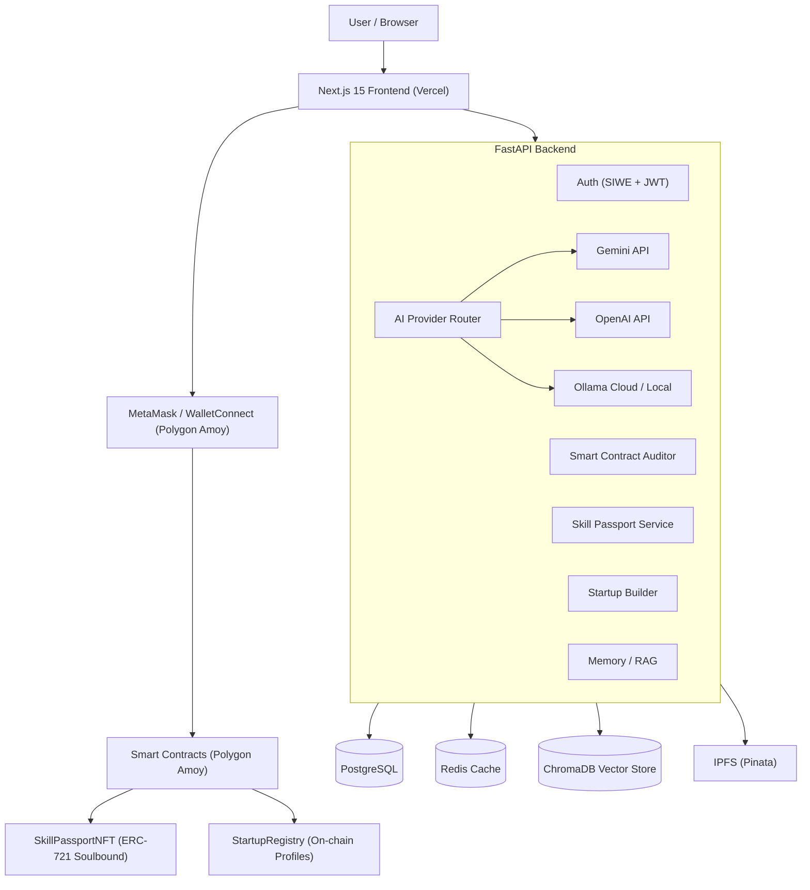

# NEXUS AI Ecosystem

AI-powered Web3 operating system for founders — AI agents, soulbound skill credentials, smart contract auditing, and startup tools on Polygon Amoy.

[](package.json)
[](apps/api/pyproject.toml)
[](apps/web)
[](apps/api)
[](packages/contracts)
[](tests)
[](apps/web)

**Repository:** [github.com/00Aryan22/nexus-ecosystem](https://github.com/00Aryan22/nexus-ecosystem)

---

## Live Application

| Environment | URL |
|-------------|-----|
| Frontend | [https://nexus-ecosystem-web.vercel.app](https://nexus-ecosystem-web.vercel.app) |
| Backend API | [https://nexus-api-1swe.onrender.com](https://nexus-api-1swe.onrender.com) |
| Health Check | [https://nexus-api-1swe.onrender.com/health](https://nexus-api-1swe.onrender.com/health) |
| API Docs | [https://nexus-api-1swe.onrender.com/docs](https://nexus-api-1swe.onrender.com/docs) |

---

## Project Overview

NEXUS AI combines AI agents with Web3 infrastructure to give founders a unified platform for building, launching, and managing blockchain startups.

The platform addresses several challenges:
- **Fragmented tools** — AI chat, smart contract auditing, skill credentials, and startup management are scattered across siloed services
- **Reputation portability** — Skill verification is centralized; NEXUS uses soulbound NFT credentials for on-chain reputation
- **AI provider flexibility** — A multi-provider LLM layer supports Gemini, OpenAI, and Ollama (cloud or local) with a health-aware router

---

## Core Features

| Feature | Description | Status |
|---------|-------------|--------|
| **AI Founder Agent** | Chat-based AI assistant with memory, context, and multi-provider LLM support | Production deployed |
| **Startup Builder** | On-chain startup registration and management | Production deployed |
| **Smart Contract Auditor** | AI-powered Solidity security analysis with gas optimization | Production deployed |
| **Skill Passport** | Soulbound NFT credentials (ERC-721) minted on Polygon Amoy | Production deployed |
| **DAO Center** | Governance and community tools | Implemented |
| **Workspace** | Knowledge documents with RAG vector search | Implemented |
| **Analytics** | Platform usage and event tracking | Implemented |
| **Wallet Authentication** | SIWE (Sign-In with Ethereum) via RainbowKit + wagmi | Production deployed |
| **Contract Deployment** | Developer infrastructure — verification, ABI lookup, gas estimation, templates | Implemented |
| **AI Provider Configuration** | Per-user provider/model settings | Implemented |

---

## AI Provider Architecture

NEXUS uses a pluggable LLM provider system with health-aware routing:

| Provider | Production Status | Notes |
|----------|-----------------|-------|
| **Gemini** | `RATE_LIMITED` | `gemini-2.0-flash` configured; free-tier quota exhausted on Render |
| **OpenAI** | `NOT_CONFIGURED` | Key must be set on Render dashboard (old key compromised) |
| **Ollama Cloud** | `NOT_CONFIGURED` | Key must be set on Render dashboard |
| **Ollama Local** | `LOCAL_ONLY` | Works when Ollama runs locally at `http://127.0.0.1:11434` |

Key design points:
- All API keys remain **server-side only** — never exposed to the browser via `NEXT_PUBLIC_*`
- Provider health is reported truthfully: `HEALTHY`, `RATE_LIMITED`, `NOT_CONFIGURED`, `MISCONFIGURED`, `MODEL_UNAVAILABLE`, `LOCAL_ONLY`
- The LLM Router selects providers based on availability, user preference, and configured model
- Ollama Cloud uses Bearer token authentication normalized for `https://ollama.com/api`

---

## Web3 Authentication

```
Connect Wallet (MetaMask / WalletConnect)
  → GET /api/v1/auth/nonce (SIWE nonce generation)
  → wallet.signMessage() (user signs SIWE message)
  → POST /api/v1/auth/verify (signature verification)
  → JWT + secure HttpOnly cookies issued
  → Authenticated dashboard access
```

- **Network:** Polygon Amoy (Chain ID: 80002)
- **Stack:** RainbowKit + wagmi + SIWE + JWT + secure cookies
- **Session:** Access + refresh tokens with CSRF protection
- **Status:** Implemented and deployed; real wallet interaction requires MetaMask

---

## Architecture



---

## Technology Stack

| Category | Technologies |
|----------|-------------|
| **Frontend** | Next.js 15, React 19, TypeScript 5.8, Tailwind CSS, shadcn/ui, Framer Motion, Zustand, TanStack Query, RainbowKit, wagmi |
| **Backend** | Python 3.12, FastAPI, SQLAlchemy (async), Alembic, Pydantic, Redis, ChromaDB |
| **AI** | Gemini, OpenAI, Ollama (cloud + local), Provider Router, RAG with vector embeddings |
| **Blockchain** | Solidity 0.8.28, Hardhat, OpenZeppelin, Polygon Amoy, WalletConnect, SIWE |
| **Storage** | PostgreSQL, Redis, ChromaDB (vectors), IPFS (Pinata) |
| **Auth** | SIWE (EIP-4361), JWT, secure HttpOnly cookies, CSRF protection |
| **Testing** | pytest (145 tests), vitest (79 tests), Playwright (56 tests + demo), Ruff, ESLint |
| **CI/CD** | GitHub Actions, Turborepo, Playwright, SQLite in-memory for backend tests |
| **Deployment** | Vercel (frontend), Render (backend), Docker Compose |

---

## Repository Structure

```
nexus-ecosystem/
├── apps/
│   ├── api/                    # FastAPI backend (Python)
│   │   ├── app/
│   │   │   ├── core/           # Config, database, security
│   │   │   ├── models/         # SQLAlchemy ORM models
│   │   │   ├── schemas/        # Pydantic request/response schemas
│   │   │   ├── services/       # Business logic layer
│   │   │   │   ├── ai/         # Context builder, AI service
│   │   │   │   ├── auditor/    # Contract audit + gas optimization
│   │   │   │   ├── founder_agent/ # Agent prompts & service
│   │   │   │   └── llm/        # LLM provider registry + router
│   │   │   └── modules/        # Route handlers (11 modules)
│   │   ├── alembic/            # Database migrations
│   │   └── tests/              # Pytest suite (145 tests)
│   └── web/                    # Next.js 15 frontend (TypeScript)
│       ├── app/                # App Router pages
│       ├── components/         # React components (shadcn/ui)
│       ├── hooks/              # Custom React hooks
│       ├── lib/                # API client, utilities
│       └── store/              # Zustand state management
├── packages/
│   ├── contracts/              # Solidity + Hardhat
│   │   ├── contracts/          # Smart contracts
│   │   ├── scripts/            # Deploy scripts
│   │   └── test/               # Hardhat tests
│   └── agents/                 # Agent framework
├── tests/                      # Playwright E2E tests
│   ├── smoke/                  # Production smoke tests (20)
│   ├── functional/             # Feature + network tests
│   ├── responsive/             # Mobile viewport tests
│   ├── demo/                   # Demo video recording
│   ├── pages/                  # Page object models
│   ├── fixtures/               # Test fixtures
│   └── helpers/                # Network monitor helper
├── infra/
│   └── docker/                 # Docker Compose + Dockerfiles
├── docs/                       # Documentation
├── .github/
│   └── workflows/              # GitHub Actions CI
├── render.yaml                 # Render deployment blueprint
├── vercel.json                 # Vercel configuration
├── playwright.config.ts        # Playwright E2E config
├── playwright.demo.config.ts   # Demo video config
├── .env.example                # Environment variable template
└── package.json                # Turborepo root
```

---

## Local Development

### Prerequisites

- **Node.js** >= 22
- **Python** >= 3.11
- **PostgreSQL** 16 (Docker recommended)
- **Redis** 7 (Docker recommended)
- **MetaMask** browser extension (for wallet testing)

### Quick Start

```bash
# Clone
git clone https://github.com/00Aryan22/nexus-ecosystem.git
cd nexus-ecosystem

# Install frontend dependencies
npm install

# Start infrastructure (PostgreSQL + Redis)
docker compose -f infra/docker/docker-compose.yml up -d postgres redis

# Backend setup
cd apps/api
python -m venv .venv
# Windows: .venv\Scripts\activate  |  macOS/Linux: source .venv/bin/activate
pip install -r requirements.txt
uvicorn app.main:app --reload --port 8000

# Frontend (new terminal)
cd apps/web
npm run dev
```

The application will be available at:
- Frontend: http://localhost:3000
- Backend API: http://localhost:8000
- API Docs: http://localhost:8000/docs

### Environment Configuration

1. Copy the example files (placeholders only, no real secrets):

```bash
cp .env.example .env.local
```

2. Edit `.env.local` with your credentials. Required variables:

| Variable | Description |
|----------|-------------|
| `DATABASE_URL` | PostgreSQL connection string |
| `JWT_SECRET_KEY` | Secret for signing JWT tokens (min 32 chars) |
| `GEMINI_API_KEY` | Google Gemini API key |
| `SIWE_DOMAIN` | Your frontend domain |
| `SIWE_URI` | Your frontend URL |

3. For the frontend, set `NEXT_PUBLIC_WALLETCONNECT_PROJECT_ID` in Vercel dashboard.

> **Never commit `.env.local`.** It is gitignored. Production secrets go in Vercel and Render dashboards.

### Smart Contracts (optional)

```bash
cd packages/contracts
npm run compile      # Compile Solidity
npm test            # Run Hardhat tests
```

---

## Testing

### Backend (pytest)

```bash
cd apps/api
pytest tests -v --tb=short
# 145 passed, 3 skipped (Emergent AI not configured)
ruff check app tests
ruff format app tests --check
```

### Frontend (vitest)

```bash
cd apps/web
npm run test            # vitest (79 tests)
npm run lint            # ESLint
npm run typecheck       # tsc --noEmit
npm run build           # Next.js production build
```

### Playwright (E2E)

```bash
# Smoke tests against production (20 tests)
npx playwright test tests/smoke/ --project=chromium

# Full suite (56 tests)
npx playwright test --project=chromium

# Demo video recording (5.8 min)
npx playwright test --config=playwright.demo.config.ts
```

### Verified Test Results

| Suite | Tests | Passed | Failed | Skipped |
|-------|-------|--------|--------|---------|
| pytest (backend) | 148 | 145 | 0 | 3 |
| Ruff lint | - | Pass | - | - |
| Ruff format | 100 files | Pass | - | - |
| vitest (frontend) | 79 | 79 | 0 | 0 |
| ESLint | - | Pass | - | - |
| TypeScript type-check | - | Pass | - | - |
| Next.js build | 32 pages | Pass | - | - |
| Playwright Chromium | 56 | 56 | 0 | 0 |
| Playwright production smoke | 20 | 20 | 0 | 0 |
| Demo video | 1 | 1 (5.8 min) | 0 | 0 |

3 skipped backend tests cover the Emergent AI provider (not configured by default).

---

## Deployment

| Component | Platform | URL |
|-----------|----------|-----|
| Frontend | Vercel | [nexus-ecosystem-web.vercel.app](https://nexus-ecosystem-web.vercel.app) |
| Backend | Render | [nexus-api-1swe.onrender.com](https://nexus-api-1swe.onrender.com) |
| API Health | Render | [nexus-api-1swe.onrender.com/health](https://nexus-api-1swe.onrender.com/health) |

The `render.yaml` blueprint defines the backend service with auto-deploy from `main`. Environment variables marked `sync: false` must be set manually in the Render dashboard:

- `DATABASE_URL`, `JWT_SECRET_KEY`, `GEMINI_API_KEY`, `OPENAI_API_KEY`, `OLLAMA_API_KEY`
- `POLYGON_AMOY_RPC_URL`, `PINATA_JWT`, `CORS_ORIGIN_REGEX`

The frontend deploys via Vercel with `NEXT_PUBLIC_API_URL=https://nexus-api-1swe.onrender.com/api/v1`.

---

## Security

- All AI provider keys are **server-side only** (never `NEXT_PUBLIC_*`)
- Wallet authentication uses **SIWE (EIP-4361)** with nonce replay protection
- Sessions use **JWT with secure HttpOnly cookies** and CSRF tokens
- **No private wallet keys** are stored or committed
- **`.env.local`** is gitignored and never committed
- **Secret scanning** runs before every commit
- Test artifacts (videos, reports, traces) are gitignored

---

## Current Project Status

| Category | Status |
|----------|--------|
| Frontend production | ✅ Deployed and verified (20/20 smoke tests) |
| Backend production | ✅ Deployed and operational |
| AI providers | ⚠️ Requires valid keys + Render redeploy |
| Wallet auth (manual) | ⏳ Requires MetaMask |
| Smart contracts | ✅ Compiled and tested (Polygon Amoy) |
| E2E tests | ✅ 56/56 passing |
| Demo video | ✅ 5.8 min, 1920x1080 |

See [PROJECT_STATUS.md](PROJECT_STATUS.md) and [CHANGELOG.md](CHANGELOG.md) for detailed status.

---

## Known Limitations

- **AI providers** require valid API keys on Render: OpenAI key is compromised (needs replacement), Ollama Cloud key not set, Gemini key newly rotated and awaiting redeploy
- **Gemini free tier** is rate-limited (HTTP 429) on the current Render deployment
- **Ollama Local** requires a running local Ollama instance
- **Wallet testing** with browser extension automation is not available — MetaMask interaction is manual
- **Render free tier** may cold-start (first request after inactivity takes several seconds)
- **Notifications** module has a frontend route but the backend is not yet implemented
- **Cross-browser** (Firefox, WebKit, mobile) Playwright tests are configured but not yet run

---

## Roadmap

- Deeper multi-agent orchestration across AI providers
- Expanded DAO governance workflows
- Additional blockchain network support beyond Polygon Amoy
- Enhanced AI memory with long-term vector recall
- Richer analytics dashboards
- Improved contract deployment pipeline
- Expanded integration and load testing

---

## Contributing

1. Fork the repository
2. Create a feature branch (`git checkout -b feature/your-feature`)
3. Make changes and run tests
4. Commit with descriptive messages
5. Open a pull request

---

## License

Licensing information is pending. All rights reserved — NEXUS AI Team.

---

## Project Author

[00Aryan22](https://github.com/00Aryan22)
